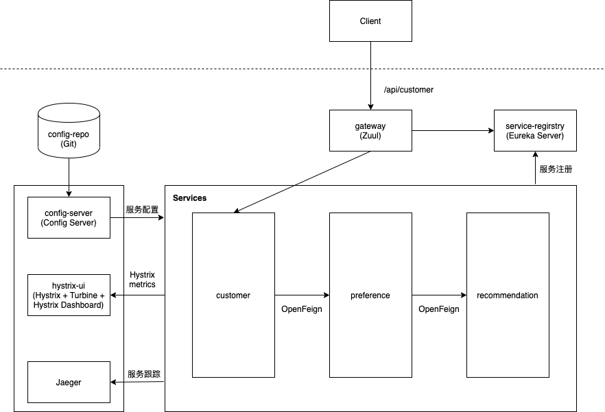

[TOC]

# 准备Spring Boot / Spring Cloud微服务demo项目


## 前言

本文描述了如何准备一个典型的Spring Boot / Spring Cloud微服务demo项目，作为后续的微服务Service Mesh迁移的基础。


## 组件、工具和版本说明

### 版本

* Java 8
* Spring Boot 2.1.1.RELEASE
* Spring Cloud Hoxton.SR9
* Maven 3.6


### **微服务组件**

* Spring Cloud Config Server: 服务配置
* Eureka：服务注册与发现
* Zuul：API网关
* OpenFeign：服务间调用
* OpenTracing： 分布式服务跟踪
* Jaeger：分布式服务跟踪可视化
* Hystrix：容错处理（熔断）
* Turbine：汇聚Hystrix指标
* Hystrix Dashboard：Hystrix指标可视化展示


### 工具

* Intellij IDEA
* PostMan：API测试
* JMeter：压力测试


## Demo项目说明

本demo项目模拟了一个简单的商店应用，包含3个简单的微服务，调用链如下：

```bash
customer -> preference -> recommendation
```


### 总体架构

项目的总体架构如下：




### 代码仓库与服务

项目的代码仓库和服务如下：

| Git Repo                 | 服务名             | 说明                                            |
| ------------------------ | ------------------ | ----------------------------------------------- |
| `store-customer`         | `customer`         | Customer服务                                    |
| `store-preference`       | `preference`       | Preference服务                                  |
| `store-recommendation`   | `recommendation`   | Recommendation服务                              |
| `store-config-repo`      | 无                 | 服务配置Git repository                          |
| `store-config-server`    | `config-server`    | 服务配置中心（Spring Cloud Config Server）      |
| `store-service-registry` | `service-registry` | 服务注册中心（Eureka Server）                   |
| `store-gateway`          | `gateway`          | API网关（Zuul）                                 |
| `store-hystrix-ui`       | `hystrix-ui`       | Hystrix Dashboard （通过Turbine汇聚Hystix指标） |
| `store-docs`             | 无                 | 项目文档                                        |


说明：

* 独立部署Jaeger。在本地用容器方式部署，在OpenShift上用Operator方式部署。


### 项目URL


#### 项目URL（本地）

* Config Server:
  * Customer服务的`local`配置： <http://localhost:8888/customer/local>
* Eureka：<http://localhost:8761/>
* Zuul:
  * Customer服务：<http://localhost:8080/api/customer>
* Hystrix Dashboard:
  * Dashboard： <http://localhost:9090/hystrix/>
  * Turbine stream: http://localhost:9090/turbine.stream?cluster=default
* Jaeger：<http://localhost:16686/>


## Demo项目详细说明

### `store-config-server`

参见：

- <https://cloud.spring.io/spring-cloud-config/reference/html/#_spring_cloud_config_server>

  

引入Maven依赖：

```xml
<dependency>
  <groupId>org.springframework.cloud</groupId>
  <artifactId>spring-cloud-config-server</artifactId>
</dependency>
```


在SpringBoot Application类上添加`@EnableConfigServer`注解。


在`src/main/resources/`下添加`bootstrap.yaml`，内容为：

```yaml
spring:
  application:
    name: config-server
  cloud:
    config:
      server:
        git:
          uri: https://github.com/cookcodeblog/store-config-repo.git
          clone-on-start: true
          default-label: main
          force-pull: true

```


说明：

* `spring.applicaiton.name`为服务名称。
* `git.url`为Config Repo的Git repository URL。
* `clone-on-start`为`true`表示Config Server启动时，就克隆Config Repo。如果配置的Config Repo有错，则Config Server启动失败。
* `default-label`指定Git repository的默认分支。
* `force-pull` 如果本地repo数据变动后，强制用远程repo更新本地repo数据。


### `store-config-repo`

参见：

* <https://cloud.spring.io/spring-cloud-config/reference/html/#_git_backend>

  

按照`<application>-<profile>.yaml`来存储多个服务的不同环境的配置信息。

其中`application`为服务的`spring.application.name`的值。


### `store-service-registry`

参见：

* <https://cloud.spring.io/spring-cloud-netflix/reference/html/>

* <https://cloud.spring.io/spring-cloud-netflix/multi/multi__service_discovery_eureka_clients.html>

* <https://cloud.spring.io/spring-cloud-netflix/multi/multi_spring-cloud-eureka-server.html>

  

引入Maven依赖：

```xml
<dependency>
  <groupId>org.springframework.cloud</groupId>
  <artifactId>spring-cloud-starter-netflix-eureka-server</artifactId>
</dependency>
```


在SpringBoot Application类上添加`@EnableEurekaServer`注解。


在`src/main/resources/`下添加`bootstrap.yaml`，内容为：

```yaml
spring:
  application:
    name: service-registry

eureka:
  client:
    registerWithEureka: false
    fetchRegistry: false
  server:
    waitTimeInMsWhenSyncEmpty: 0
```


说明：

* `spring.applicaiton.name`为服务名称。
* `registerWithEureka`为`false`表示Eureka Server不注册自己到Eureka中。
* `fetchRegistry`为`false`表示不从Eureka Server拿服务注册信息到本地。


### `store-gateway`

参见：

* <https://cloud.spring.io/spring-cloud-netflix/multi/multi__router_and_filter_zuul.html>

* <https://docs.spring.io/spring-cloud-netflix/docs/2.2.5.RELEASE/reference/html/#router-and-filter-zuul>

* <https://docs.spring.io/spring-cloud-netflix/docs/2.2.5.RELEASE/reference/html/#zuul-timeouts>

  

引入Maven依赖：

```xml
<dependency>
  <groupId>org.springframework.cloud</groupId>
  <artifactId>spring-cloud-starter-netflix-zuul</artifactId>
</dependency>
<dependency>
  <groupId>org.springframework.boot</groupId>
  <artifactId>spring-boot-starter-actuator</artifactId>
</dependency>
<dependency>
  <groupId>org.springframework.cloud</groupId>
  <artifactId>spring-cloud-starter-netflix-eureka-client</artifactId>
</dependency>
```


在SpringBoot Application类上添加`@EnableZuulProxy`注解，表示该服务为Zuul网关，再添加`@EnableEurekaClient` 注解，用来将Zuul网关注册到Eureka上。


在`src/main/resources/`下添加`bootstrap.yaml`，内容为：

```yaml
spring:
  application:
    name: gateway

```


在`src/main/resources/`下添加`application.yaml`，内容为：

```yaml

zuul:
  prefix: /api
  ignored-services: '*' # 排除所有基于Eureka服务ID的路由的注册
  routes:
    customer:
      path: '/customer/**'
      service-id: customer
      # url: http://customer:8080
  host:
    connect-timeout-millis: 10000
    socket-timeout-millis: 60000

hystrix:
  command:
    default:
      execution:
        isolation:
          thread:
            timeoutInMilliseconds: 60000

ribbon:
  ReadTimeout: 5000

eureka:
  client:
    serviceURL:
      defaultZone: http://service-registry:8080/eureka/
    fetch-registry: true
  instance:
    prefer-ip-address: true


server:
  port: ${ZUUL_PORT:8080}

logging:
  level:
    com.example.store: DEBUG

```


说明：

* `zuul.ignored-services: '*'`  排除所有基于Eureka服务ID的路由的注册，采用手工配置路由方式。
* `zuul.prefix: /api` Zuul网关的代理的URL都以`/api`开头。
* `zuul.routes.customer` 配customer服务的路由，指定路径和服务名。
* `eureka.client` 配置将Zuul作为Eureka客户端注册到Eureka上。
* `hystrix.command.default.execution.isolation.thread.timeoutInMilliseconds` 定义了默认的Hystrix超时时间。
* `ribbon.ReadTimeout` 定义了默认的Ribbon请求访问的超时时间。


### `store-customer`

参见：

* <<https://cloud.spring.io/spring-cloud-netflix/multi/multi__service_discovery_eureka_clients.html>

* <https://docs.spring.io/spring-cloud-netflix/docs/2.2.5.RELEASE/reference/html/#service-discovery-eureka-clients>

* <https://docs.spring.io/spring-cloud-netflix/docs/2.2.5.RELEASE/reference/html/#circuit-breaker-hystrix-clients>

  

引入Maven依赖：

```xml
<dependency>
  <groupId>org.springframework.boot</groupId>
  <artifactId>spring-boot-starter-actuator</artifactId>
</dependency>
<dependency>
  <groupId>org.springframework.cloud</groupId>
  <artifactId>spring-cloud-starter-netflix-eureka-client</artifactId>
</dependency>
<dependency>
  <groupId>org.springframework.cloud</groupId>
  <artifactId>spring-cloud-starter-openfeign</artifactId>
</dependency>
<dependency>
  <groupId>org.springframework.cloud</groupId>
  <artifactId>spring-cloud-starter-config</artifactId>
</dependency>
<dependency>
  <groupId>io.opentracing.contrib</groupId>
  <artifactId>opentracing-spring-jaeger-cloud-starter</artifactId>
  <version>3.2.2</version>
</dependency>
<dependency>
  <groupId>org.springframework.cloud</groupId>
  <artifactId>spring-cloud-starter-netflix-hystrix</artifactId>
</dependency>
```


在SpringBoot Application类上添加以下注解：

* `@EnableCircuitBreaker` 启用熔断。
* `@EnableFeignClients` 作为OpenFeign client通过OpenFeign调用其他服务
* `@EnableEurekaClient` 作为Eureka client注册到Eureka。


在`src/main/resources/`下添加`bootstrap.yaml`，内容为：

```yaml
spring:
  application:
    name: customer
  cloud:
    config:
      uri: http://config-server:8080/
  jpa:
    open-in-view: false

management:
  endpoints:
    web:
      exposure:
        include: "refresh,hystrix.stream" # auto refresh doesn't work ?

```


说明：

* `exposure.include` 暴露`refresh` 断点用于手工触发更新，暴露`hystrix.stream` 用于采集Hystrix指标。
* 在本地运行时在VM options中指定本地Config Server的URL: `-Dspring.cloud.config.uri=http://localhost:8888`


在`src/main/resources/`下添加`application.yaml`，内容为：


```yaml
server:
  port: 8080

eureka:         #tells about the Eureka server details and its refresh time
  instance:
    leaseRenewalIntervalInSeconds: 1
    leaseExpirationDurationInSeconds: 2
    prefer-ip-address: true
  client:
    serviceUrl:
      defaultZone: http://service-registry:8080/eureka/
    healthcheck:
      enabled: true
    lease:
      duration: 5

logging:
  level:
    com.example.store: DEBUG

ribbon:
  ReadTimeout: 5000

hystrix:
  command:
    default:
      execution:
        isolation:
          thread:
            timeoutInMilliseconds: 5000

```


说明：

* 在`spring.cloud.config.uri` 中配置Config Server的URL，用来拉取服务配置。
* `healthcheck.enabled: true` 开启Eureka健康检查。


定义接口`PreferenceFeignClient`，并使用注解`@FeignClient(value = "preference")` 来表示要以OpenFeigen方式调用`preference`服务。


在`CustomerController.getCustomer()`方法中使用注解`@HystrixCommand` 表示对该方法作熔断控制，并可指定熔断时调用的fallback方法。


### `store-preference`

和`store-customer` 类似，不再详细描述。


### `store-recommendation`

和`store-customer` 类似，不再详细描述。


### `store-hystrix-ui`

参见：

* <https://docs.spring.io/spring-cloud-netflix/docs/2.2.5.RELEASE/reference/html/#circuit-breaker-hystrix-dashboard>


引入Maven依赖：

```xml
<dependency>
  <groupId>org.springframework.cloud</groupId>
  <artifactId>spring-cloud-starter-netflix-hystrix-dashboard</artifactId>
</dependency>
<dependency>
  <groupId>org.springframework.cloud</groupId>
  <artifactId>spring-cloud-starter-netflix-turbine</artifactId>
</dependency>
```


在SpringBoot Application类上添加以下注解：

* `@EnableTurbine` 启用Turbine，采集多个实例的Hystrix指标。
* `@EnableHystrixDashboard` 启用Dashboard。
* `@EnableEurekaClient` 作为Eureka客户端注册到Eureka。


在`src/main/resources/`下添加`bootstrap.yaml`，内容为：

```yaml
spring:
  application:
    name: hystirx-ui

```


在`src/main/resources/`下添加`application.yaml`，内容为：

```yaml
eureka:
  client:
    serviceUrl:
      defaultZone: http://service-registry:8080/eureka/
  instance:
    prefer-ip-address: true

turbine:
  appConfig: "customer,preference"
  clusterNameExpression: new String("default")

hystrix:
  dashboard:
    proxyStreamAllowList: '*'

server:
  port: 8080

```


说明：

* `turbine.appConfig` 中定义要采集Hystrix指标的服务名称。
* `hystrix.dashboard.proxyStreamAllowList: '*'` 表示允许所有Hystrix stream。


### Jaeger

参见：
* <https://github.com/jaegertracing/jaeger>
* <https://github.com/opentracing-contrib/java-spring-jaeger>
* <https://github.com/opentracing-contrib/java-spring-jaeger/issues/114>
* <https://mvnrepository.com/artifact/io.opentracing.contrib/opentracing-spring-jaeger-cloud-starter>
* <https://mvnrepository.com/artifact/io.opentracing.contrib/opentracing-spring-jaeger-web-starter>


在本地启动Jager：

```bash
bash ./scripts/start_jaeger.sh
```


## 测试场景


### 本地运行

本地运行时需要指定active profile为`local`。

如果是命令行运行，则类似：

```bash
java -jar -Dspring.profiles.active=local ./store-config-server/target/store-config*.jar
```


如果需要访问本地Config Server还需要指定Config Server的地址，类似：

```bash
java -jar -Dspring.profiles.active=local \
    -Dspring.cloud.config.uri=http://localhost:8888 \
    ./store-config-server/target/*.jar
```


### 测试服务注册

打开Eureka地址查看服务注册情况。

应该包含以下服务：

- customer
- preference
- recommendation
- gateway 
- hysteria-ui


### 测试服务间调用

测试调用`customer -> preference -> recommendation`。

Postman测试：

```bash
GET
http://localhost:8080/api/customer

# 预期结果
customer => preference => recommendation v1 from 'unknown': 1
```


### 测试服务配置

测试customer服务读取的配置信息是否与profile一致。

Postman测试：

```bash
GET
http://localhost:8080/api/customer/greeting?name=Grape

# 预期结果
{
    "content": "Grape is my lucky food!"
}
```


将Spring Boot Applicaton的active profile设置为`local`，再进行测试。

```bash
# 预期结果
{
    "content": "You love Grape so much!"
}
```


### 测试熔断

打开Hystrix Dashboard，输入Turbine steam，点击monitor stream。

用JMeter模拟：

- Number of Threads (users): 100
- Ramp-up period (seconds): 1
- Loop Count: 100


测试URL

```bash
GET
http://localhost:8080/api/customer
```


开始测试后，观察Hystrix Dashboard的customer和preference服务的Circuit(断路器)是否变为黄色的Open状态（即表示熔断）。


再用Postman测试，看返回的结果是否为“Fallback: ...“，即表示熔断已生效，已自动调用fallback方法。


